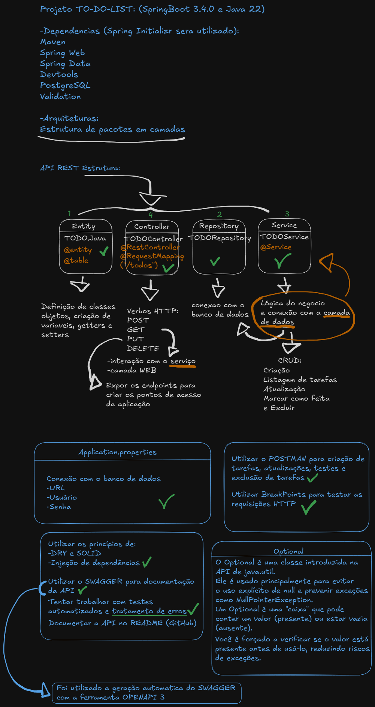

<h1 align="center">
  API ToDo List
</h1>

### API para criar e gerenciar tarefas

## Práticas adotadas no projeto:
- [API REST](https://www.ibm.com/br-pt/topics/rest-apis)
- Principio de programação [DRY](https://www.devmedia.com.br/reutilizacao-de-codigo-com-base-no-dry/33323)
- Injeção de Dependências
- Consultas com Spring Data JPA
- Tratamento de respostas de erros
- Geração automática do Swagger utilizando a [OpenAPI 3](https://www.ibm.com/docs/pt-br/app-connect/13.0?topic=apis-openapi-30)

## Tecnologias utilizadas no projeto:
- Java 22
- SpringBoot 3.4.0
- SpringData JPA
- SpringDoc OpenAPI 3
- Spring MVC
- PostgreSQL

## Swagger:
Após executar o projeto a API é acessada em localhost:8080.  
O Swagger pode ser visualizado em localhost:8080/swagger-ui.html

## Endpoints da API
Abaixo exemplos das requisições HTTP que podem ser feitas.  
Foi utilizada a ferramenta [POSTMAN](https://www.postman.com/product/what-is-postman/) para fazer as requisições HTTP.
Após algumas requisições especificas (POST, PUT, DELETE) a aplicação irá retornar a lista de tarefas completa.

- Método POST para criar uma tarefa:
```
POST http://localhost:8080/todos

  {
    "nome": "Tarefa 1",
    "descricao": "Fazer compras",
    "realizado": true,
    "prioridade": 3
  }
```
- Método GET para listar todas as tarefas:
```
GET http://localhost:8080/todos

  {
    "id": "da9c4cb1-b315-4ed9-9afb-0ab74d8c8a43",
    "nome": "Tarefa 1",
    "descricao": "Fazer compras",
    "realizado": true,
    "prioridade": 3
  }
```
- Método GET para listar todas as tarefas feitas:
```
GET http://localhost:8080/todos/realizadas

  {
    "id": "da9c4cb1-b315-4ed9-9afb-0ab74d8c8a43",
    "nome": "Tarefa 1",
    "descricao": "Fazer compras",
    "realizado": true,
    "prioridade": 3
  }
```
- Método GET para listar uma tarefa pelo seu proprio id:
```
GET http://localhost:8080/todos/da9c4cb1-b315-4ed9-9afb-0ab74d8c8a43

  {
    "id": "da9c4cb1-b315-4ed9-9afb-0ab74d8c8a43",
    "nome": "Tarefa 1",
    "descricao": "Fazer compras",
    "realizado": true,
    "prioridade": 3
  }
```
- Método PUT para atualizar uma tarefa:
```
PUT http://localhost:8080/todos/da9c4cb1-b315-4ed9-9afb-0ab74d8c8a43

  {
    "nome": "Tarefa 1",
    "descricao": "Fazer compras",
    "realizado": true,
    "prioridade": 1
  }
```
- Método DELETE para remover uma tarefa:
```
DELETE http://localhost:8080/todos/da9c4cb1-b315-4ed9-9afb-0ab74d8c8a43
```
## Pensando sobre a API
Como um adicional deixo algumas anotações do que eu pensei e aprendi antes, durante e depois de construir essa API.
